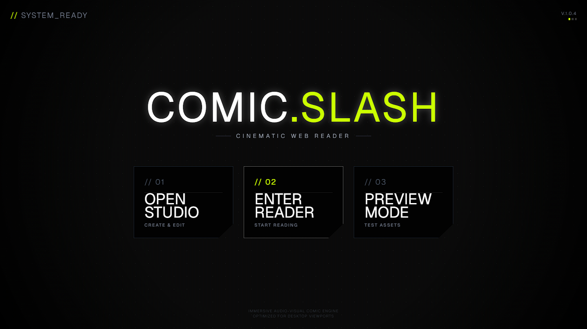

# ⚡ Comic Slash (Leak Rader)


> **A powerful, cinematic web-based comic creator and reader.**  
> *Built for storytellers who want to break the mold.*



---

## 📸 Screenshots

### Homepage


### Studio — Series list


### Studio — Scene editor


### Reader — Series overview


### Reader — Chapter view


### Reader — No spoilers mode


---

## 🚀 Overview

**Comic Slash** is a next-generation comic creation tool that brings a cinematic feel to web comics. It moves beyond static images, offering dynamic layouts, immersive reading experiences, and a powerful studio editor—all running directly in the browser.

Whether you're creating a quick meme or a full-blown graphic novel, Comic Slash gives you the tools to make it pop.

---

## ✨ Key Features

### 🎨 **The Studio** (`/studio`)
*Create stunning scenes in seconds.*
- **Dynamic Layouts**: Switch instantly between **Split**, **Slash**, and **Grid** layouts.
- **Precision Control**: Scale, position, and mirror images with pixel-perfect sliders.
- **Dialogue Engine**: Drag-and-drop bubbles with "Normal" and "Shout" styles.
- **JSON Power**: Export your work as JSON and share it or save it for later.

### 📖 **Cinematic Reader** (`/reader`)
*An immersive reading experience.*
- **Atmospheric UI**: Features CRT scanlines, vignettes, and dynamic film-strip borders.
- **Smart Navigation**:
  - ⌨️ **Keyboard**: Arrow keys for desktop users.
  - 📱 **Touch**: Invisible left/right touch zones for mobile.
  - 🖱️ **UI**: Sleek, auto-hiding navigation buttons.
- **Responsive Design**: Layouts adapt perfectly to any screen size.

### 👁️ **Instant Preview** (`/preview`)
*Test before you ship.*
- Paste your Studio JSON to instantly see how your comic looks in the full Reader environment.

---

## 🛠️ Tech Stack

| Category | Technology | Description |
| :--- | :--- | :--- |
| **Framework** | [Next.js 16](https://nextjs.org/) | App Router + Turbopack for lightning-fast builds. |
| **Styling** | [Tailwind CSS 4](https://tailwindcss.com/) | Utility-first CSS for rapid UI development. |
| **Language** | [TypeScript](https://www.typescriptlang.org/) | Type-safe code for robustness. |
| **Icons** | [Lucide React](https://lucide.dev/) | Beautiful, consistent icons. |
| **UI** | [Radix UI](https://www.radix-ui.com/) | Accessible, unstyled UI primitives. |

---

## 📦 Getting Started

Ready to start creating? Follow these steps:

### 1. Clone the Repository
```bash
git clone https://github.com/Yuslash/comic-slash.git
cd comic-slash
```

### 2. Install Dependencies
```bash
npm install
```

### 3. Run Development Server
```bash
npm run dev
```

### 4. Launch! 🚀
Open your browser and navigate to:
- **Home**: [http://localhost:3000](http://localhost:3000)
- **Studio**: [http://localhost:3000/studio](http://localhost:3000/studio)

---

## 🎮 Usage Guide

### 🖌️ Creating a Comic
1.  **Head to the Studio**: Click "Studio" on the home page.
2.  **Add a Scene**: Click the `+` button and choose a layout (e.g., Slash).
3.  **Add Images**: Paste image URLs into the input fields.
4.  **Tweak It**: Use the sliders to zoom and position your images perfectly.
5.  **Speak Up**: Click "Add Dialogue" to drop a speech bubble.
6.  **Export**: Hit "GET JSON" to copy your masterpiece's code.

### 👓 Reading a Comic
1.  **Go to Preview**: Navigate to the Preview page.
2.  **Paste Data**: Paste the JSON code you copied from the Studio.
3.  **Enjoy**: Click "Initialize Reader" and enjoy the show!

---

## 📂 Project Structure

A quick look under the hood:

```bash
app/
├── globals.css        # 🎨 Global styles (The "Cinematic" look)
├── page.tsx           # 🏠 Landing page
├── preview/           # 👁️ Preview logic
├── reader/            # 📖 Reader engine
└── studio/            # 🎨 Editor logic
components/
├── comic/
│   ├── ComicEditor.tsx        # The heart of the Studio
│   ├── ComicReader.tsx        # The heart of the Reader
│   ├── ComicSceneRenderer.tsx # Renders individual scenes
│   └── layouts/               # Layout engines (Split, Slash, Grid)
└── ui/                        # Shared UI components
```

---

## 🤝 Contributing

Got an idea? Found a bug? We'd love your help!
1.  Fork the repo.
2.  Create a new branch (`git checkout -b feature/amazing-feature`).
3.  Commit your changes.
4.  Push to the branch.
5.  Open a Pull Request.

---

## 📄 License

Distributed under the MIT License. See `LICENSE` for more information.

---

<p align="center">
  Built with ❤️ by <a href="https://github.com/Yuslash">Yuslash</a>
</p>
